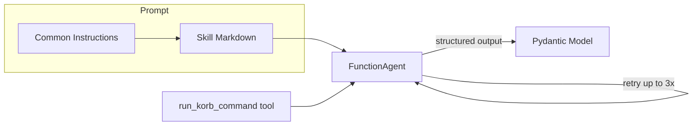
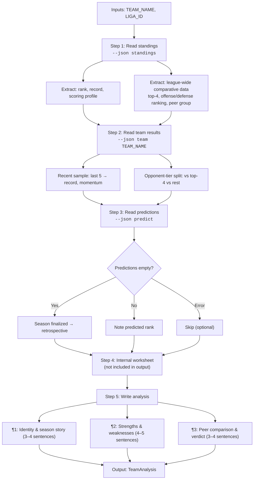
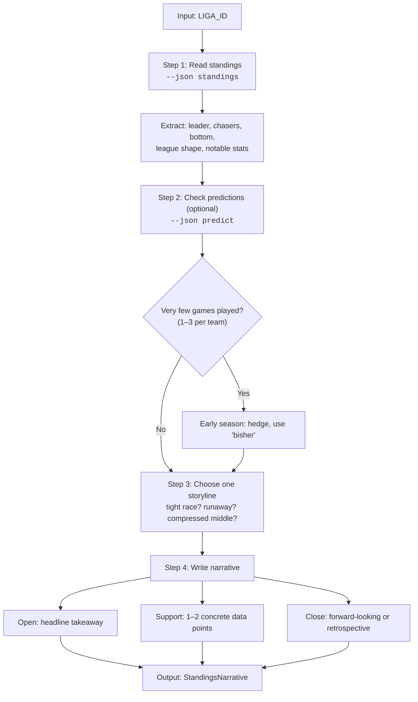
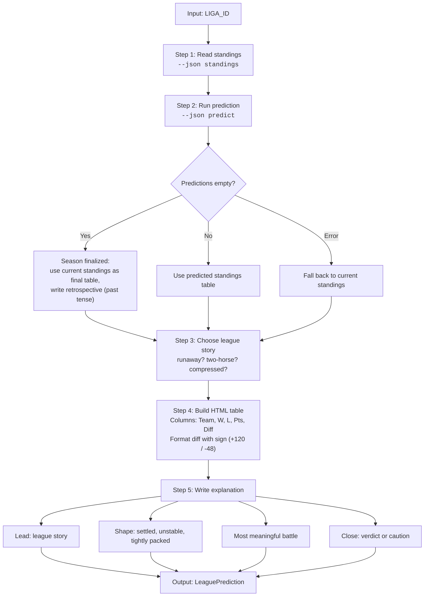
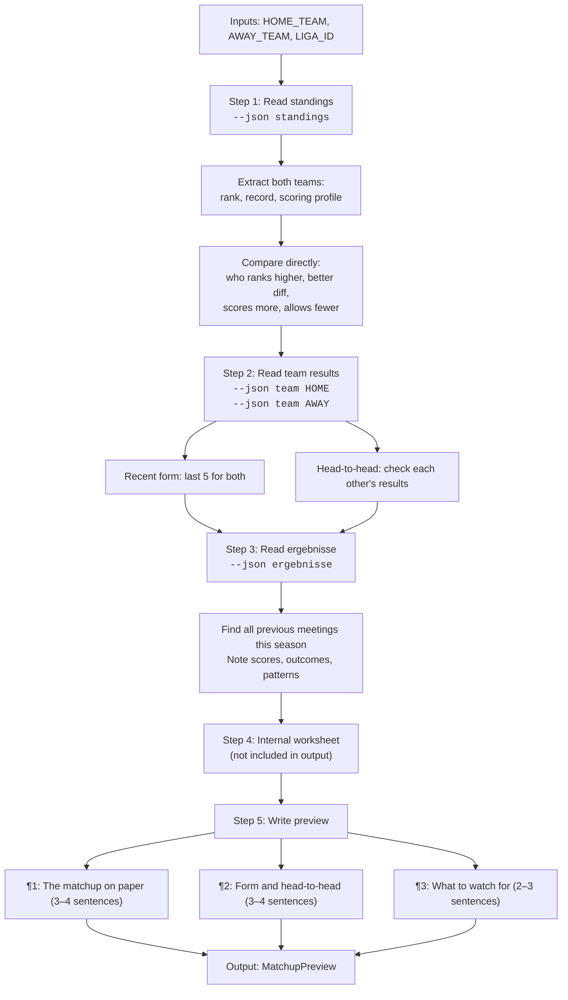

# AI Agent Skills

Developer documentation for the four AI agents in korbPuls. Each agent is a
[LlamaIndex FunctionAgent](https://docs.llamaindex.ai/) with a dedicated
**skill file** (loaded as the system prompt) and a **Pydantic output model**
(for structured responses).

> **Note:** The skill `.md` files are loaded directly into the agent's system
> prompt. Keep them lean — every token counts against the context window.

---

## Architecture

- **Common instructions** (`agents.py` → `_COMMON_INSTRUCTIONS`): shared
  constraints (exact team names, German output, HTML only, no jargon).
- **Skill markdown**: step-by-step analysis workflow loaded per agent.
- **Tool**: `run_korb_command` — scoped access to the `korb` CLI for fetching
  standings, schedules, results, and predictions.
- **Retry logic** (`main.py` → `_retry_agent`): up to 3 attempts with
  exponential backoff. Handles both exceptions and `None` structured output.

### Trigger Modes

| Agent | Trigger | When |
|---|---|---|
| Commentator | **Auto** | After every data refresh (if data changed or AI missing) |
| Oracle | **Auto** | After every data refresh (if prediction-eligible) |
| Analyst | **Manual** | Button on team page |
| Scout | **Manual** | Button on matchup page |

A startup recovery hook (`_recover_ai_analyses`) re-triggers any missing or
failed auto-generated analyses after server restarts.

---

## Agents

### 1. Analyst → Team Analysis

**Role:** Deep-dive on a single team — identity, strengths, weaknesses, peer
comparison.

**Skill:** [`TEAM_ANALYSIS.md`](TEAM_ANALYSIS.md)
**Output model:** `TeamAnalysis` (2–3 `
` elements, 10–15 sentences)

---

### 2. Commentator → Standings Narrative

**Role:** Quick, accessible league overview — one interesting storyline.

**Skill:** [`STANDINGS_NARRATIVE.md`](STANDINGS_NARRATIVE.md)
**Output model:** `StandingsNarrative` (1 `
` element, 3–5 sentences)

---

### 3. Oracle → League Prediction

**Role:** Predicted final standings table with explanatory analysis.

**Skill:** [`LEAGUE_PREDICTION.md`](LEAGUE_PREDICTION.md)
**Output model:** `LeaguePrediction` (HTML `<table>` + 1 `
` element)

---

### 4. Scout → Matchup Preview

**Role:** Pre-game analysis for an upcoming head-to-head matchup.

**Skill:** [`MATCHUP_PREVIEW.md`](MATCHUP_PREVIEW.md)
**Output model:** `MatchupPreview` (2–3 `
` elements, 8–12 sentences)

---

## Common Constraints

All agents share these rules (defined in `_COMMON_INSTRUCTIONS`):

| Rule | Rationale |
|---|---|
| Use exact team names from standings data | Prevents hallucinated/mismatched names |
| Write in German with proper umlauts (ä, ö, ü, ß) | Target audience is German amateur basketball community |
| Generate original analysis — never copy skill examples | Prevents template-like output |
| Always use HTML, never Markdown | Output is rendered directly in web templates |
| No jargon | Audience includes parents and casual fans |
| Return only structured output required by schema | Keeps responses focused and parseable |

## Adding a New Agent

1. Create a skill file in `src/korbpuls/ai/skills/NEW_SKILL.md`
2. Define a Pydantic output model in `agents.py`
3. Create a `get_<name>()` factory function in `agents.py`
4. Add the trigger logic in `main.py` (auto via `_fetch_and_auto_generate` or manual via POST route)
5. If auto-generated, add recovery logic to `_recover_ai_analyses`